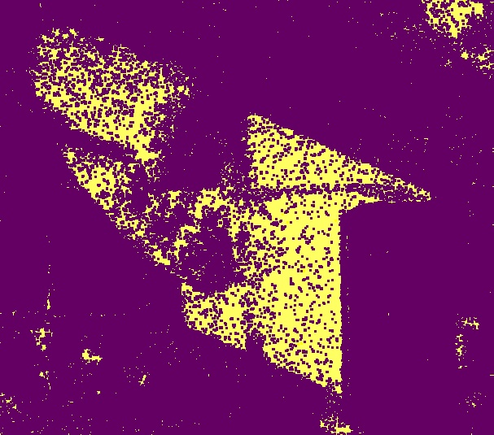
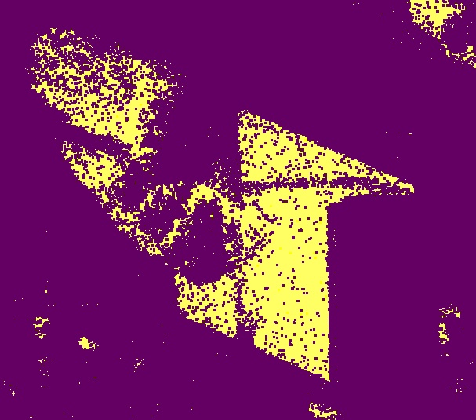
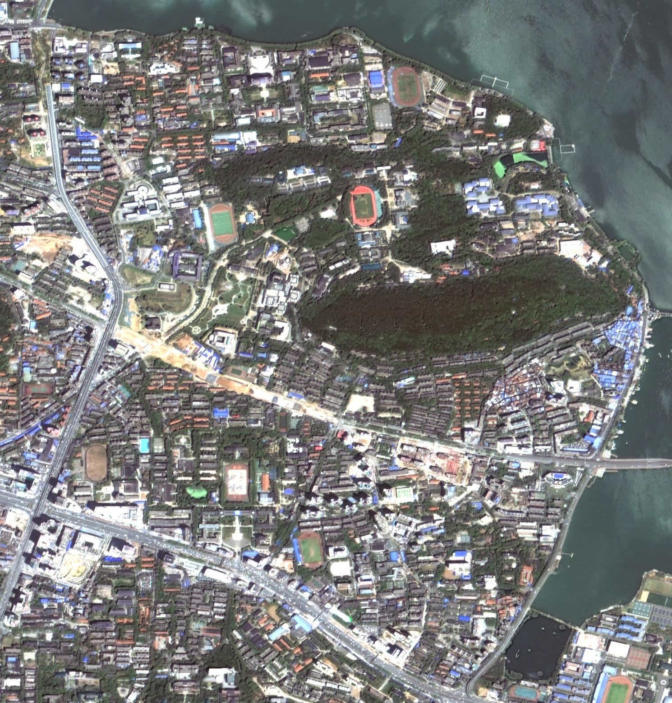
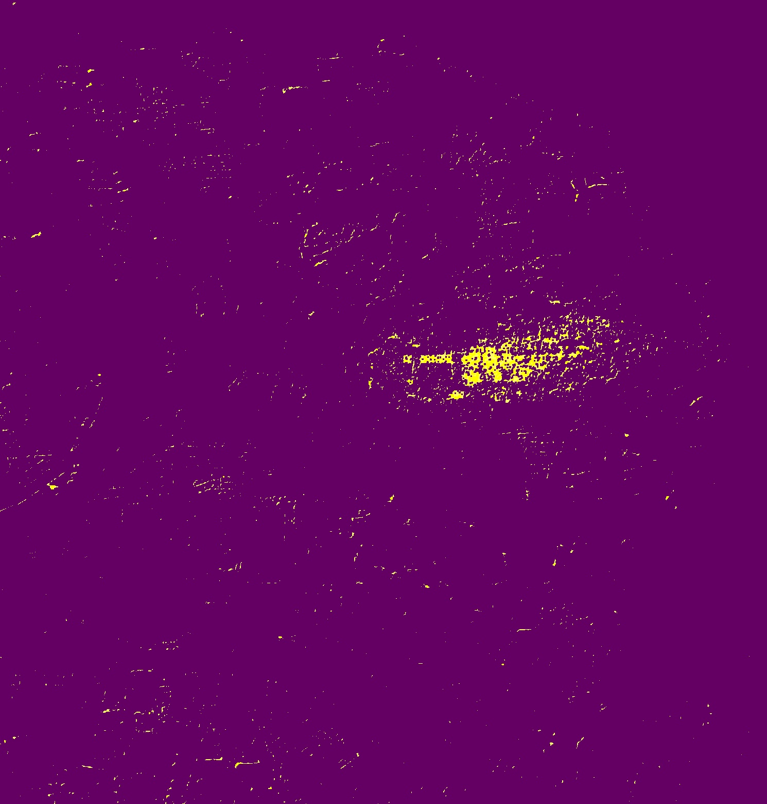
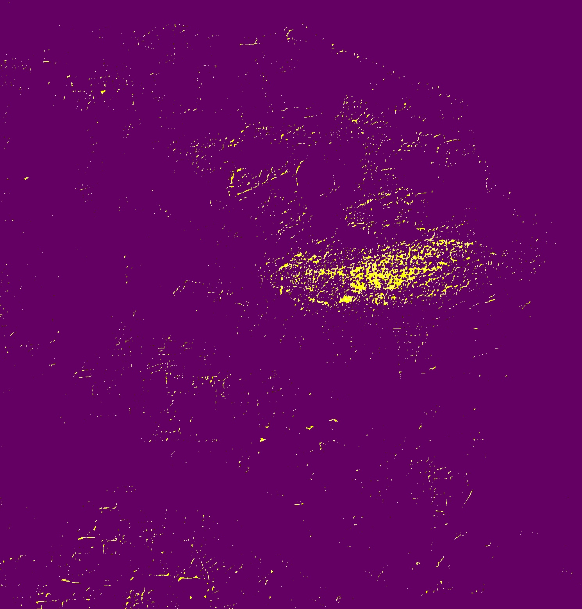

# RSImage-Shadow-Detection
### `【武汉大学遥感学院】遥感原理与方法实习 | 基于HSV和C1C2C3彩色空间的阴影检测`
[ShadowDetetcion.cpp](./ShadowDetetcion.cpp)**核心代码**

## HSV色彩空间
在HSV彩色空间中（色相/饱和度/明度（Hue/Saturation/Value）），遥感影像阴影区域与非阴影区域相比有以下3 个特点：  
- 阴影区域具有更大的色调值;  
- 阴影区域的散射光线主要来自波长更短的蓝紫色光，因此具有高饱和度值;  
- 阴影区域太阳光线被阻挡，导致低亮度值. 

>将彩色影像进行RGB到HSV色彩空间变换，依据阴影区域的高色调值、低亮度值和高饱和度特性，定义M=(S－V)/(H+S+V)进行阈值选择分割出阴影区域。

## C1C2C3色彩空间
利用RGB彩色空间单色波段进行阴影检测精度低，可引入C1C2C3彩色空间进行阴影检测。在C1C2C3彩色空间的C3分量中，阴影区域主要占据的是高像素值。

#### 实现过程
通过对C3分量图采用阈值分割的方法得到初步阴影区域。但原始影像中的偏蓝色地物在C3分量中就具有很高的像素值，必须将这些区域从阴影区域中去除。为此，需要将C3分量图和B分量图相结合，采用双阈值来进行阴影检测。只有在C3分量中高于某个阈值，并在B 分量中低于某个阈值的区域，才被检测成为阴影区域。

    
   
